# 基于Spark的Netflix Prize电影推荐系统（包括离线推荐与实时推荐）

>数据集：[我的百度云分享](https://pan.baidu.com/s/1boWBwnX)

## 离线推荐

- 基于Spark MLlib自带的ALS最小二乘法矩阵分解算法，比较简单，文档也比较多，就不详细说了:-D。。。
- 选择的迭代次数iterations=5，物品、用户特征个数K=50
- 使用了RMSE方法评价推荐精度，结果为0.5757

不同iterations、K值组合下，RMSE值表现

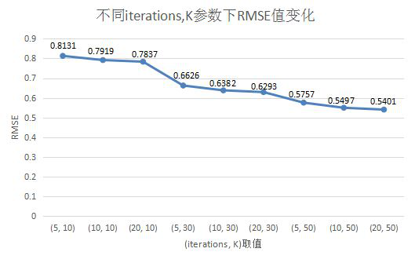

## 实时推荐

### 实时推荐算法设计

设计的实时算法的大体思想是：

当用户u对电影p进行了评分，将触发一次对u的推荐结果的更新。由于用户u对电影p评分，对于用户u来说，他与p最相似的电影们之间的推荐强度将发生变化，所以选取与电影p最相似的K个电影作为候选电影。
每个候选电影按照“推荐优先级”这一权重作为衡量这个电影被推荐给用户u的优先级。
这些电影将根据用户u最近的若干评分计算出各自对用户u的推荐优先级，然后与上次对用户u的实时推荐结果的进行基于推荐优先级的合并、替换得到更新后的推荐结果。

	注意：由于Netflix Prize数据电影间相似度无法直接计算，这里利用ALS算法的物品矩阵进行cos计算得到各个电影间相似度，详情见Doc下文档

具体算法设计实现文档在目录Doc下

### 实时推荐延迟测试

#### 下面的数据结果分别是瞬间产生1000、5000、10000、30000、50000个评分数据情况下实时推荐系统的响应时间表现

**batchDuration选择了2s**

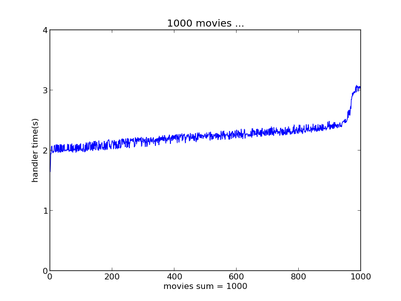
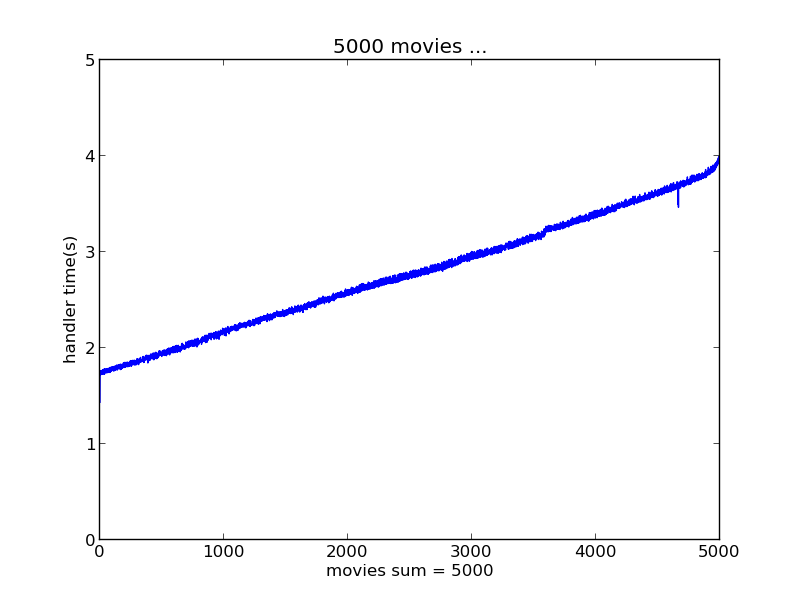
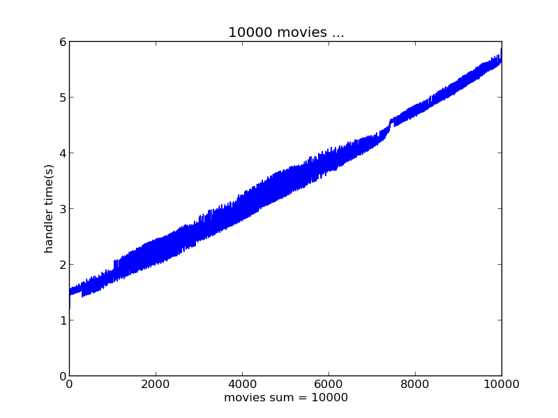
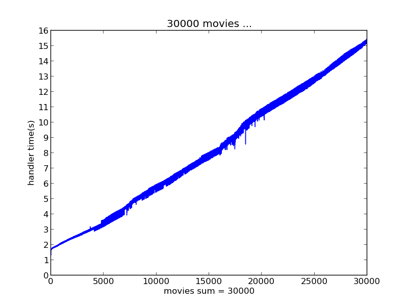
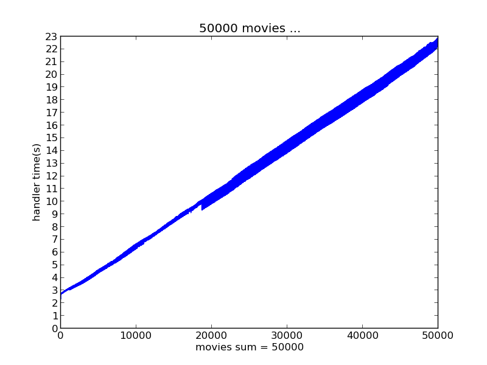

将以上这些测试结果汇总对比如图

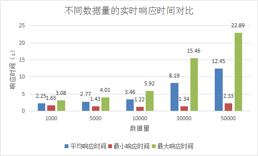

#### 保持一定的速度逐渐产生大量评分时实时推荐系统的响应时间表现

a.速度为500个数据量每秒时

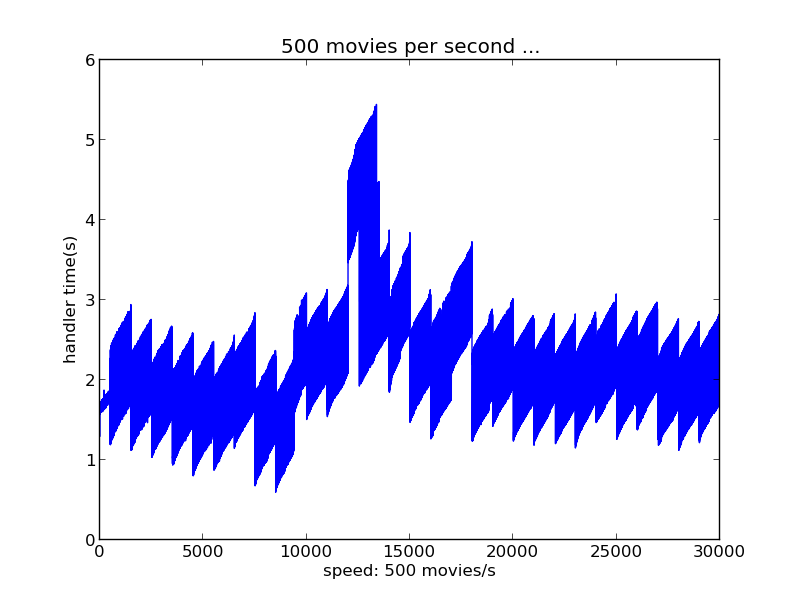

横坐标没有数学意义，而是作为每个评分的标识；纵坐标表示了对应横坐标上的评分的实时推荐响应时间，单位为秒。在每秒产生500个评分数据的速率下，实时推荐系统性能良好，最慢的实时推荐也在6s内完成。

b.速度为1000个数据量每秒时

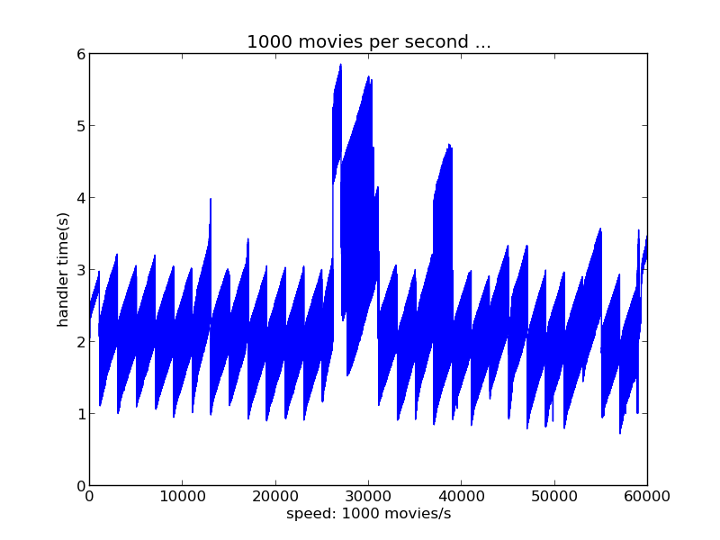

横纵坐标意义同上。从图中可以看到，在每秒产生1000个评分数据的速率下，实时推荐系统性能良好，最慢的实时推荐也在6s内完成。与每秒500个评分的速率下实时表现差不多。

c.速度为1500个数据量每秒时

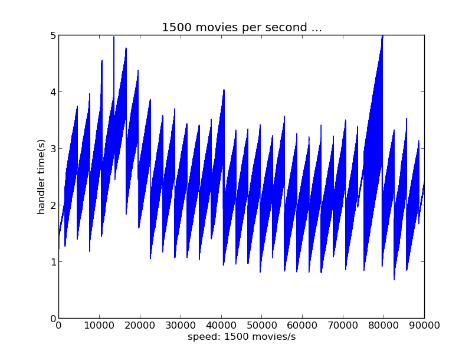
横纵坐标意义同上。在每秒产生1500个评分数据的速率下，实时推荐系统性能良好，最慢的实时推荐也在5s内完成。与每秒500、1000个评分的速率下实时表现差不多。

d.速度为2000个数据量每秒时

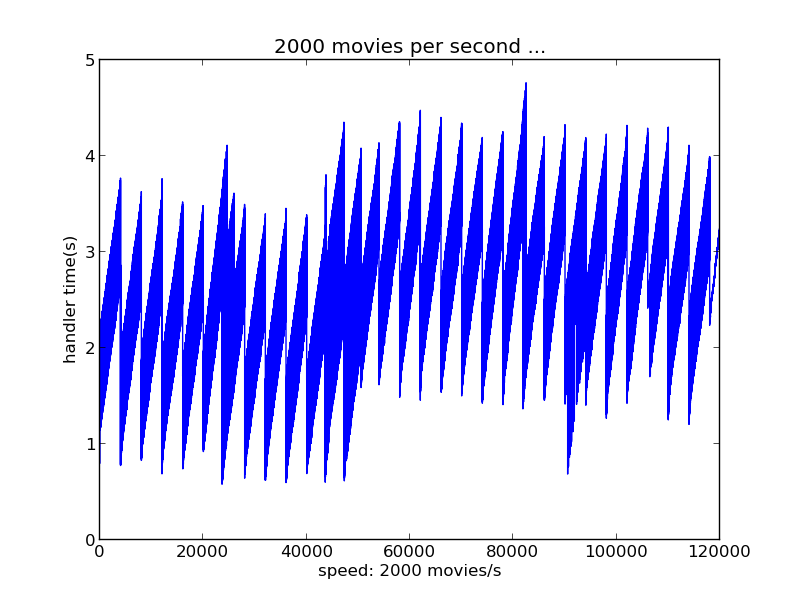
横纵坐标意义同上。横纵坐标意义同上。在每秒产生1500个评分数据的速率下，实时推荐系统性能良好，最慢的实时推荐也在5s内完成。与每秒500、1000、1500个评分的速率下实时表现差不多。

e.速度为2500个数据量每秒时

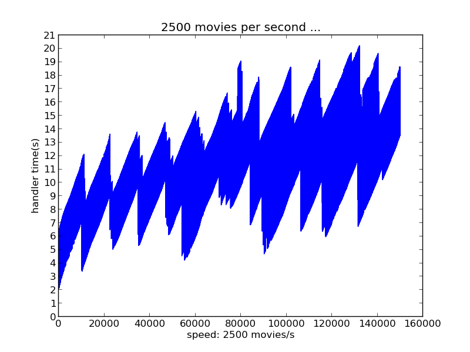

横纵坐标意义同上。在每秒产生2500个评分数据的速率下，实时推荐系统随着时间推移性能开始下降，这是由于数据堆积产生的问题：当新数据到来时，还有旧数据没有处理完成，造成新数据堆积等待处理，使得被堆积的数据实时响应时间增大。可以看到，在1分钟内实时推荐响应时间逐渐升至20s。可以预见，2500个评分数据/s的速率保持时间越长，实时推荐响应时间越慢。

f.速度为3000个数据量每秒时

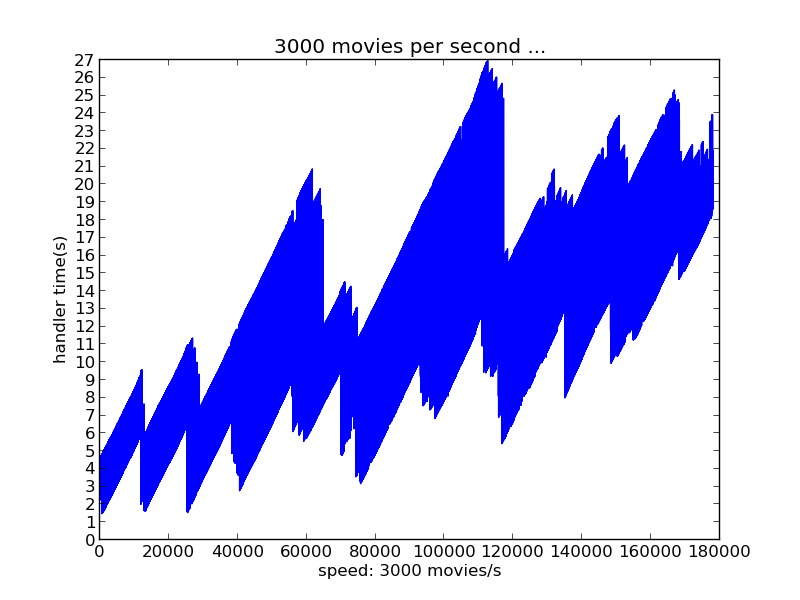

## 项目结构

- alsBatchRecommender.scala: ALS离线推荐，以及计算电影间相似度
- streamingRecommender.scala: 实时推荐

